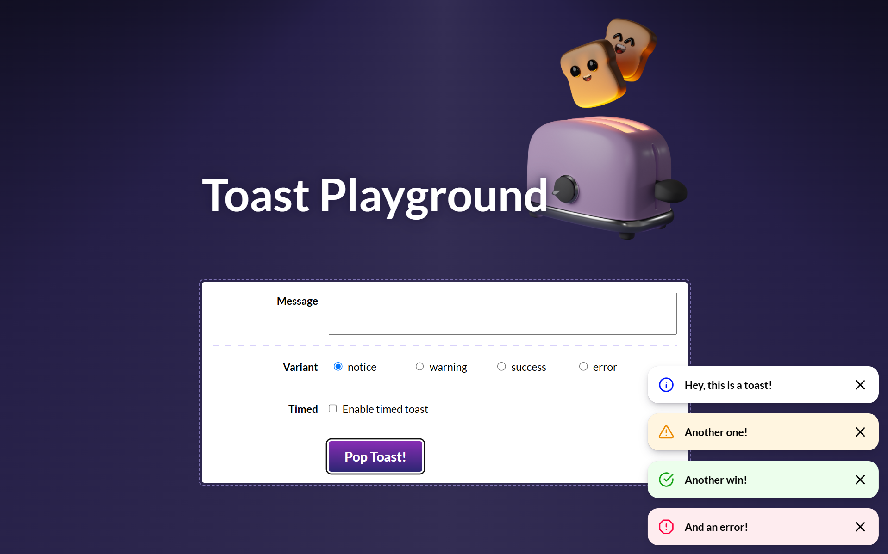

# Implementación Componente Toast desde 0

## Descripción

Este proyecto es una aplicación de notificaciones Toast construida con React. Los Toasts son mensajes emergentes que aparecen en la parte inferior derecha de la pantalla y desaparecen automáticamente después de un período de tiempo. Puedes personalizar los mensajes, seleccionar entre diferentes variantes (aviso, advertencia, éxito y error), y cerrar los toasts manualmente.

### Características

- Añadir notificaciones de tipo Toast con diferentes variantes.
- Cierre automático de los Toasts después de un período determinado.
- Cierre manual de los Toasts mediante un botón.
- Descartar todos los Toasts presionando la tecla "Escape".
- Implementación de un hook personalizado `useEscapeKey` para manejar eventos de teclas.
- **Accesibilidad mejorada**: Uso de atributos ARIA (`aria-live`, `aria-label`) y el componente `VisuallyHidden` para asegurar que los Toasts sean accesibles y correctamente anunciados por los lectores de pantalla.