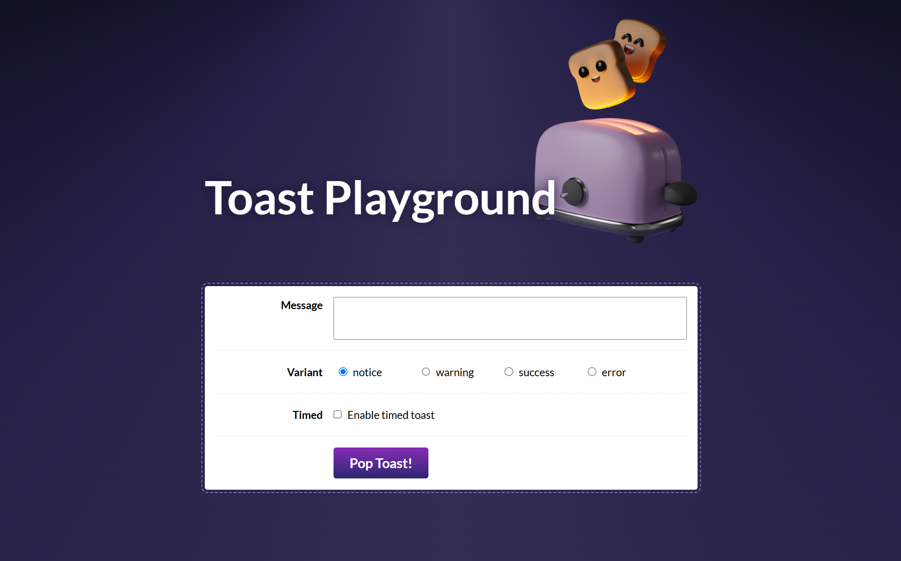

# Toast Component Implementation from Scratch

## Description

This project is a Toast notifications application built with React. Toasts are pop-up messages that appear in the bottom right corner of the screen and automatically disappear after a set period. You can customize the messages, choose from different variants (info, warning, success, and error), and manually close the toasts.

### Features

- Add Toast notifications with different variants.
- Auto-dismiss Toasts after a specified period.
- Manually close Toasts via a button.
- Dismiss all Toasts by pressing the "Escape" key.
- Custom hook `useEscapeKey` implementation to handle keyboard events.
- **Enhanced Accessibility**: Utilizes ARIA attributes (`aria-live`, `aria-label`) and the `VisuallyHidden` component to ensure that Toasts are accessible and properly announced by screen readers.
